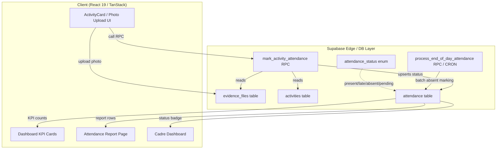
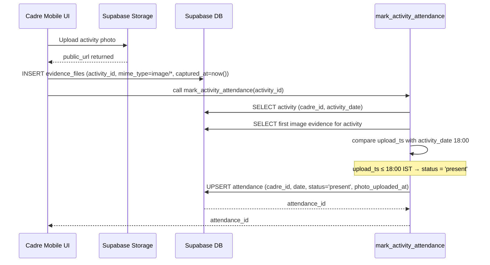
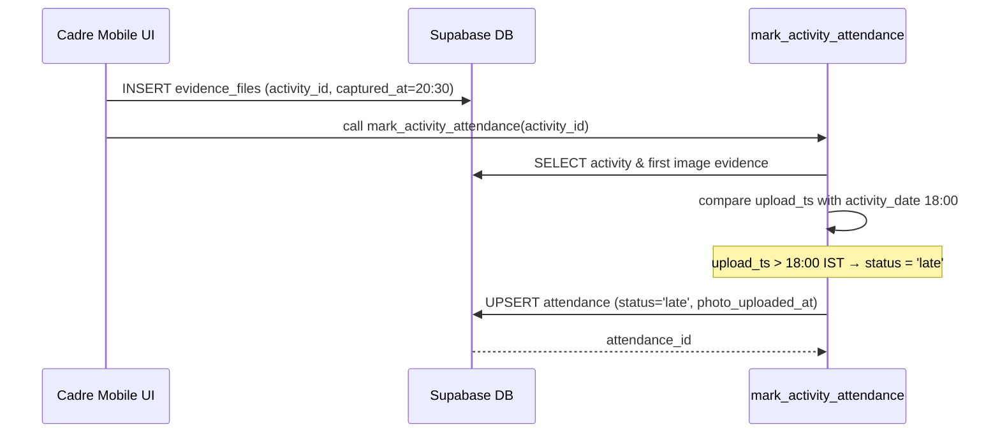
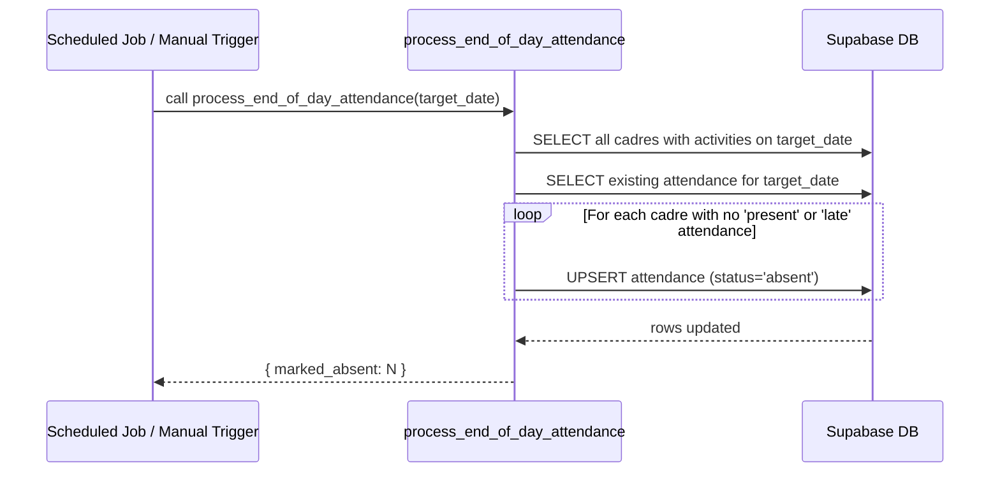

# Design Document: Attendance Photo Logic

## Overview

This feature updates the attendance determination logic for the NRLM Cadre Connect platform so
that a cadre member's daily attendance status is driven entirely by the timestamp of their
activity-photo upload relative to their activity date. The four possible statuses are:
**Present** (photo uploaded on the activity date at or before 6:00 PM), **Late** (photo uploaded
after 6:00 PM), **Absent** (no photo uploaded by end-of-day processing), and **Pending** (no
photo yet and the 6:00 PM deadline has not yet passed for today). Dashboard KPIs, status badges,
and attendance reports are updated to reflect all four values.

The system sits on top of the existing Supabase + React 19 / TypeScript / TanStack Router stack.
The current `attendance_status` enum (`present | absent | on_leave | holiday |
pending_verification`) is extended/remapped to accommodate the new `late` and a formal `pending`
state, and the PostgreSQL function `mark_activity_attendance` is replaced with a
time-aware version.

---

## Architecture



---

## Sequence Diagrams

### 1. Photo Uploaded Before 6 PM (Present)



### 2. Photo Uploaded After 6 PM (Late)



### 3. No Photo — End-of-Day Processing (Absent)



### 4. Pending State — During the Day (Before 6 PM, No Photo)

```mermaid
sequenceDiagram
    participant UI as Dashboard / Cadre UI
    participant DB as Supabase DB

    UI->>DB: SELECT attendance WHERE cadre_id=? AND date=today
    DB-->>UI: No row found (or status='pending')
    Note over UI: Time < 18:00 → render Pending badge (yellow)
    Note over UI: No auto-insert; pending is a derived/default state
```

---

## Components and Interfaces

### Component 1: `mark_activity_attendance` (PostgreSQL RPC)

**Purpose**: Core time-aware attendance classifier. Called every time a photo is uploaded.

**Interface**:
```typescript
// Supabase client call
const { data, error } = await supabase.rpc('mark_activity_attendance', {
  p_activity_id: string  // UUID
});
// Returns: UUID (attendance_id) | null
```

**Responsibilities**:
- Validate photo evidence exists for the activity
- Retrieve the activity's `activity_date` and the evidence's `created_at` timestamp
- Convert both to IST (UTC+5:30) for comparison
- Determine status: `present` if upload ≤ 18:00 IST on activity_date, else `late`
- UPSERT the `attendance` row with the computed status and `photo_uploaded_at`
- Write link record to `activity_attendance_links`

---

### Component 2: `process_end_of_day_attendance` (PostgreSQL RPC)

**Purpose**: Batch job that marks any cadre who had an activity on `target_date` but never
uploaded a photo as `absent`. Called after end-of-day (e.g., 11:59 PM IST via a CRON or manual admin trigger).

**Interface**:
```typescript
const { data, error } = await supabase.rpc('process_end_of_day_attendance', {
  p_target_date: string  // ISO date 'YYYY-MM-DD'
});
// Returns: { marked_absent: number }
```

**Responsibilities**:
- Find all cadres with at least one activity on `target_date`
- Exclude those already having `present` or `late` attendance for that date
- Insert/update remaining attendance rows to `absent`

---

### Component 3: `AttendanceStatusBadge` (React Component)

**Purpose**: Renders a colour-coded pill badge for a given attendance status string.

**Interface**:
```typescript
interface AttendanceStatusBadgeProps {
  status: 'present' | 'late' | 'absent' | 'pending' | 'on_leave' | 'holiday';
  size?: 'sm' | 'md';
}
function AttendanceStatusBadge({ status, size }: AttendanceStatusBadgeProps): JSX.Element
```

**Responsibilities**:
- Present → green badge (`bg-emerald-50 text-emerald-700`)
- Late → orange badge (`bg-orange-50 text-orange-700`)
- Absent → red badge (`bg-rose-50 text-rose-700`)
- Pending → yellow badge (`bg-amber-50 text-amber-700`)

---

### Component 4: Dashboard KPI Card — Attendance Summary

**Purpose**: Shows Present / Late / Absent / Pending counts for today.

**Interface** (existing `dashboard.index.tsx` extension):
```typescript
interface AttendanceKpiStats {
  presentCount:  number;
  lateCount:     number;
  absentCount:   number;
  pendingCount:  number;  // cadres with activities today but no attendance record yet
  totalCadres:   number;
}
```

**Responsibilities**:
- Query `attendance` table for today's date
- Derive `pendingCount` = total cadres with activities today − (present + late + absent)
- Render four clickable rows, each opening a detail sheet

---

### Component 5: `AttendanceReport` (existing component — updated)

**Purpose**: Tabular report with filtering, Excel/CSV export.

**New columns / values**:
- Status filter dropdown adds `late` and `pending` options
- `STATUS_MAP` extended: `late → "Late"`, `pending → "Pending"`
- Summary row at footer: Total Present | Total Late | Total Absent | Total Pending

---

## Data Models

### Updated `attendance_status` Enum

```sql
-- New values added to the existing PostgreSQL enum
ALTER TYPE public.attendance_status ADD VALUE IF NOT EXISTS 'late';
ALTER TYPE public.attendance_status ADD VALUE IF NOT EXISTS 'pending';
```

> **Note**: `pending_verification` (existing) is kept for backward compatibility.
> The new `pending` value represents "no photo yet, within deadline window".
> Front-end code treats both as the yellow Pending badge.

### `attendance` Table — New Column

```sql
ALTER TABLE public.attendance
  ADD COLUMN IF NOT EXISTS photo_uploaded_at TIMESTAMPTZ;
```

| Column              | Type          | Description                                      |
|---------------------|---------------|--------------------------------------------------|
| `id`                | UUID PK       | Row identifier                                   |
| `cadre_id`          | UUID FK       | Cadre (profiles.id)                              |
| `block_id`          | UUID FK       | Block (blocks.id)                                |
| `date`              | DATE          | Attendance date                                  |
| `attendance_date`   | DATE          | Sync column (= date)                             |
| `status`            | enum          | `present` / `late` / `absent` / `pending`        |
| `photo_uploaded_at` | TIMESTAMPTZ   | **New** — timestamp of the qualifying photo upload |
| `check_in_at`       | TIMESTAMPTZ   | First check-in time (same as photo_uploaded_at for photo-based flow) |
| `latitude`          | DOUBLE        | Photo geo-tag latitude                           |
| `longitude`         | DOUBLE        | Photo geo-tag longitude                          |
| `recorded_by`       | UUID FK       | Who triggered the mark                           |
| `remarks`           | TEXT          | Optional remarks                                 |

### `evidence_files` Table (unchanged, key fields)

| Column       | Type        | Description                              |
|--------------|-------------|------------------------------------------|
| `activity_id`| UUID FK     | Links to `activities.id`                 |
| `mime_type`  | TEXT        | Must be `image/*` to qualify             |
| `created_at` | TIMESTAMPTZ | Upload timestamp — primary classification clock |
| `latitude`   | DOUBLE      | Geo-tag (required by existing geo-rule)  |
| `longitude`  | DOUBLE      | Geo-tag (required by existing geo-rule)  |

### `activities` Table (key fields referenced)

| Column          | Type   | Description                        |
|-----------------|--------|------------------------------------|
| `cadre_id`      | UUID   | Owner cadre                        |
| `activity_date` | DATE   | The date the activity took place   |
| `block_id`      | UUID   | Block context                      |

---

## Algorithmic Pseudocode

### Main Classification Algorithm: `classifyAttendanceStatus`

```pascal
ALGORITHM classifyAttendanceStatus(upload_ts, activity_date)
INPUT:
  upload_ts      : TIMESTAMPTZ  -- UTC timestamp of evidence_files.created_at
  activity_date  : DATE         -- YYYY-MM-DD of the activity
OUTPUT:
  status         : attendance_status  -- 'present' | 'late'

BEGIN
  -- Convert both to IST (UTC+5:30)
  upload_ist       ← upload_ts AT TIME ZONE 'Asia/Kolkata'
  deadline_ist     ← (activity_date || ' 18:00:00')::TIMESTAMPTZ AT TIME ZONE 'Asia/Kolkata'

  IF upload_ist <= deadline_ist THEN
    RETURN 'present'
  ELSE
    RETURN 'late'
  END IF
END
```

**Preconditions**:
- `upload_ts` is a valid non-null TIMESTAMPTZ
- `activity_date` is a valid ISO date string
- The upload date (in IST) must equal `activity_date` (photos on wrong date are rejected upstream)

**Postconditions**:
- Returns `'present'` if and only if `upload_ist ≤ 18:00 IST on activity_date`
- Returns `'late'` otherwise
- No side effects

---

### Key Functions with Formal Specifications

#### `mark_activity_attendance(p_activity_id)`

```pascal
FUNCTION mark_activity_attendance(p_activity_id : UUID) : UUID | NULL

PRECONDITIONS:
  - activity with p_activity_id exists in activities table
  - caller is the activity's cadre_id OR is an admin/staff
  - at least one image evidence file exists for p_activity_id

POSTCONDITIONS:
  - IF no photo evidence: RETURN NULL (no attendance change)
  - IF photo evidence found:
    - attendance row upserted with status ∈ {present, late}
    - attendance.photo_uploaded_at = first_photo.created_at
    - attendance.check_in_at      = COALESCE(existing.check_in_at, now())
    - activity_attendance_links row upserted
    - RETURN attendance.id

ALGORITHM:
  BEGIN
    activity  ← SELECT * FROM activities WHERE id = p_activity_id
    IF NOT FOUND THEN RAISE EXCEPTION
    
    photo ← SELECT first image evidence WHERE activity_id = p_activity_id
             AND mime_type LIKE 'image/%'
             AND latitude IS NOT NULL AND longitude IS NOT NULL
             ORDER BY created_at ASC LIMIT 1
    IF NOT FOUND THEN RETURN NULL
    
    status ← classifyAttendanceStatus(photo.created_at, activity.activity_date)
    
    UPSERT INTO attendance (cadre_id, date, status, photo_uploaded_at, ...)
    ON CONFLICT (cadre_id, date)
    DO UPDATE SET status = EXCLUDED.status,
                  photo_uploaded_at = EXCLUDED.photo_uploaded_at,
                  updated_at = now()
    
    UPSERT INTO activity_attendance_links (activity_id, attendance_id, ...)
    
    RETURN attendance.id
  END
```

**Boundary cases**:
- Upload at exactly 18:00:00 IST → `present`
- Upload at 18:00:01 IST → `late`

---

#### `process_end_of_day_attendance(p_target_date)`

```pascal
FUNCTION process_end_of_day_attendance(p_target_date : DATE) : JSONB

PRECONDITIONS:
  - p_target_date ≤ CURRENT_DATE (cannot process future dates)
  - Caller is service_role or admin

POSTCONDITIONS:
  - Every cadre with an activity on p_target_date who has no 'present' or 'late'
    attendance record for that date receives status = 'absent'
  - Returns { "marked_absent": N } where N is number of rows updated

ALGORITHM:
  BEGIN
    cadres_with_activities ← SELECT DISTINCT cadre_id, block_id
                              FROM activities
                              WHERE activity_date = p_target_date

    already_marked ← SELECT cadre_id FROM attendance
                     WHERE date = p_target_date
                       AND status IN ('present', 'late', 'on_leave', 'holiday')

    to_absent ← cadres_with_activities EXCEPT already_marked

    count ← 0
    FOR EACH (cadre_id, block_id) IN to_absent DO
      UPSERT INTO attendance (cadre_id, block_id, date, status)
      VALUES (cadre_id, block_id, p_target_date, 'absent')
      ON CONFLICT (cadre_id, date)
      DO UPDATE SET status = 'absent', updated_at = now()
      WHERE attendance.status NOT IN ('present', 'late', 'on_leave', 'holiday')
      count ← count + 1
    END FOR

    RETURN jsonb_build_object('marked_absent', count)
  END
```

**Safety invariant**: An existing `present` or `late` row is **never** downgraded to `absent`.

---

#### `deriveAttendanceStatus` (TypeScript — client-side display helper)

```typescript
// Used by UI to determine badge colour when reading from DB
function deriveAttendanceStatus(
  dbStatus: string | null,
  activityDate: string,       // 'YYYY-MM-DD'
  currentTime: Date = new Date()
): 'present' | 'late' | 'absent' | 'pending' {

  // PRECONDITIONS:
  //   dbStatus is from attendance.status or null (no row)
  //   activityDate is the date of the cadre's activity

  if (dbStatus === 'present') return 'present';
  if (dbStatus === 'late')    return 'late';
  if (dbStatus === 'absent')  return 'absent';

  // No DB row yet — derive pending vs absent based on time
  const deadline = new Date(`${activityDate}T18:00:00+05:30`);
  const isToday   = activityDate === toISTDateString(currentTime);

  IF isToday AND currentTime <= deadline THEN
    RETURN 'pending'   // before 6 PM today — still within window
  ELSE
    RETURN 'absent'    // past deadline or past day — treat as absent
  END IF
}
```

---

## Example Usage

### Uploading a Photo and Getting Attendance Status (TypeScript)

```typescript
// 1. Upload photo evidence file
const { data: evidence } = await supabase
  .from('evidence_files')
  .insert({
    activity_id: activityId,
    cadre_id:    session.user.id,
    storage_path: storagePath,
    public_url:   publicUrl,
    file_name:    file.name,
    mime_type:    'image/jpeg',
    latitude:     coords.latitude,
    longitude:    coords.longitude,
    captured_at:  new Date().toISOString(),
  })
  .select()
  .single();

// 2. Trigger attendance classification
const { data: attendanceId } = await supabase
  .rpc('mark_activity_attendance', { p_activity_id: activityId });

if (attendanceId) {
  // 3. Fetch resulting status to update UI
  const { data: att } = await supabase
    .from('attendance')
    .select('status, photo_uploaded_at')
    .eq('id', attendanceId)
    .single();

  console.log(att?.status); // 'present' | 'late'
}
```

### Querying Dashboard KPI Counts (TypeScript)

```typescript
const { data: attData } = await supabase
  .from('attendance')
  .select('status, cadre_id')
  .eq('date', todayIST);

const presentCount = attData?.filter(a => a.status === 'present').length ?? 0;
const lateCount    = attData?.filter(a => a.status === 'late').length    ?? 0;
const absentCount  = attData?.filter(a => a.status === 'absent').length  ?? 0;

// Pending = cadres with today's activities who have no attendance record yet
// (computed by comparing cadres with activities vs attendance rows)
const pendingCount = totalCadresWithActivitiesToday - presentCount - lateCount - absentCount;
```

### Status Badge Rendering (React / TypeScript)

```typescript
const STATUS_CONFIG = {
  present: { label: 'Present', bg: 'bg-emerald-50', text: 'text-emerald-700', border: 'border-emerald-200', icon: CheckCircle2 },
  late:    { label: 'Late',    bg: 'bg-orange-50',  text: 'text-orange-700',  border: 'border-orange-200',  icon: Clock       },
  absent:  { label: 'Absent',  bg: 'bg-rose-50',    text: 'text-rose-700',    border: 'border-rose-200',    icon: XCircle     },
  pending: { label: 'Pending', bg: 'bg-amber-50',   text: 'text-amber-700',   border: 'border-amber-200',   icon: Hourglass   },
} as const;

function AttendanceStatusBadge({ status }: { status: keyof typeof STATUS_CONFIG }) {
  const cfg = STATUS_CONFIG[status];
  const Icon = cfg.icon;
  return (
    <span className={`inline-flex items-center gap-1.5 rounded-full border px-3 py-1.5
                      text-[10px] font-black uppercase tracking-wide
                      ${cfg.bg} ${cfg.text} ${cfg.border}`}>
      <Icon className="h-3.5 w-3.5" />
      {cfg.label}
    </span>
  );
}
```

---

## Correctness Properties

These are universal invariants that must hold at all times after the feature is deployed.

1. **Present is on-time**: For every attendance row with `status = 'present'`,
   `photo_uploaded_at AT TIME ZONE 'Asia/Kolkata' ≤ (date + '18:00:00')::TIMESTAMPTZ AT TIME ZONE 'Asia/Kolkata'`.

2. **Late is after deadline**: For every attendance row with `status = 'late'`,
   `photo_uploaded_at AT TIME ZONE 'Asia/Kolkata' > (date + '18:00:00')::TIMESTAMPTZ AT TIME ZONE 'Asia/Kolkata'`.

3. **Photo mandatory for present/late**: No row has `status IN ('present', 'late')` with
   `photo_uploaded_at IS NULL`.

4. **Absent implies no qualifying photo**: For any cadre/date combination with `status = 'absent'`,
   there must be no image evidence file for any activity on that date by that cadre.

5. **Pending is transient**: `status = 'pending'` rows only appear on `date = CURRENT_DATE`
   and only before the end-of-day processing job runs.

6. **No downgrade**: Once a row reaches `present` or `late`, it is never changed to `absent`.
   `UPDATE … SET status='absent' WHERE status NOT IN ('present', 'late', …)` enforces this.

7. **KPI consistency**: `presentCount + lateCount + absentCount + pendingCount ≤ totalCadres`.

8. **Boundary exactness**: Upload at 18:00:00 IST exactly yields `present`, not `late`.

---

## Error Handling

### Scenario 1: Photo upload succeeds, RPC call fails

**Condition**: Network error or DB error when calling `mark_activity_attendance`  
**Response**: Return `null`, display toast error to cadre  
**Recovery**: Cadre can retry — RPC is idempotent (UPSERT ON CONFLICT)

### Scenario 2: Photo has no geo-tag

**Condition**: `evidence_files.latitude IS NULL` or `longitude IS NULL`  
**Response**: `mark_activity_attendance` returns `NULL` (no attendance marked) — existing geo-tag rule  
**Recovery**: Cadre must re-upload photo with location enabled

### Scenario 3: Activity not found during RPC call

**Condition**: `p_activity_id` does not exist  
**Response**: `RAISE EXCEPTION 'Activity % not found'` → Supabase returns 500  
**Recovery**: Client catches error, displays error message; should not happen in normal flow

### Scenario 4: End-of-day job runs twice on same date

**Condition**: Duplicate trigger of `process_end_of_day_attendance`  
**Response**: UPSERT with `WHERE status NOT IN ('present', 'late', …)` makes it idempotent  
**Recovery**: Second run produces 0 changes — safe

### Scenario 5: Photo uploaded on wrong day (activity_date ≠ upload date)

**Condition**: Cadre uploads photo a day late for a previous activity  
**Response**: RPC classifies based on original `activity_date` vs `photo.created_at`;
upload will be `late` relative to the activity date  
**Recovery**: Status correctly set to `late` — no special handling needed

---

## Testing Strategy

### Unit Testing Approach

Test the pure classification logic in isolation using Vitest:

```typescript
describe('classifyAttendanceStatus', () => {
  it('returns present for upload at exactly 18:00:00 IST', () => { ... });
  it('returns present for upload at 17:59:59 IST', () => { ... });
  it('returns late for upload at 18:00:01 IST', () => { ... });
  it('returns late for upload at 20:30:00 IST', () => { ... });
  it('handles UTC timestamps correctly converted to IST', () => { ... });
});
```

### Property-Based Testing Approach

**Property Test Library**: fast-check

```typescript
import fc from 'fast-check';

// Property 1: Any upload at or before 18:00 IST → present
fc.assert(fc.property(
  fc.date({ min: dayStart, max: deadline }),
  (uploadTime) => classifyAttendanceStatus(uploadTime, activityDate) === 'present'
));

// Property 2: Any upload after 18:00 IST → late
fc.assert(fc.property(
  fc.date({ min: afterDeadline, max: dayEnd }),
  (uploadTime) => classifyAttendanceStatus(uploadTime, activityDate) === 'late'
));

// Property 3: No upload + time < deadline → pending
fc.assert(fc.property(
  fc.date({ min: dayStart, max: deadline }),
  (currentTime) => deriveAttendanceStatus(null, todayStr, currentTime) === 'pending'
));

// Property 4: No upload + time > deadline → absent
fc.assert(fc.property(
  fc.date({ min: afterDeadline, max: dayEnd }),
  (currentTime) => deriveAttendanceStatus(null, todayStr, currentTime) === 'absent'
));
```

### Integration Testing Approach

- Test the Supabase RPC `mark_activity_attendance` with controlled `created_at` values
- Test `process_end_of_day_attendance` creates absent rows only for eligible cadres
- Test that UPSERT does not downgrade `present` → `absent`
- Test dashboard KPI query returns correct counts for all four statuses

### Test Scenario Matrix

| Scenario | Photo Time | Activity Date | Expected Status |
|----------|-----------|---------------|-----------------|
| On time  | 5:45 PM IST  | Same day | Present |
| Boundary | 6:00 PM IST  | Same day | Present |
| Just late| 6:01 PM IST  | Same day | Late    |
| Evening  | 8:30 PM IST  | Same day | Late    |
| No photo (before 6 PM) | — | Today | Pending |
| No photo (after 6 PM)  | — | Today | Absent  |
| No photo (past day)    | — | Yesterday | Absent |

---

## Performance Considerations

- `attendance` table already has index on `(cadre_id, date DESC)` and `date DESC`
- `photo_uploaded_at` column does not need an additional index for the classification query
- Dashboard KPI query already filters by single `date = dateStr` — O(1) with existing index
- End-of-day batch: typically O(N) where N = cadres with activities per day — expected <500 rows
- No polling needed; RPC is triggered on photo upload events (event-driven)

---

## Security Considerations

- `mark_activity_attendance` uses `SECURITY DEFINER` — caller authorization checked inside
- Cadres can only mark attendance for their own activities (enforced by `v_activity.cadre_id = auth.uid()`)
- `process_end_of_day_attendance` restricted to `service_role` to prevent manual abuse
- `photo_uploaded_at` is set server-side from `evidence_files.created_at` — clients cannot forge timestamps
- Existing geo-tag validation ensures photos without coordinates are rejected

---

## Dependencies

| Dependency | Role | Version |
|---|---|---|
| Supabase PostgreSQL | Database, RLS, RPCs | Existing |
| `@supabase/supabase-js` | Client SDK | `^2.107.0` |
| React 19 + TanStack Router | UI framework | Existing |
| `@tanstack/react-query` | Data fetching & caching | `^5.83.0` |
| `date-fns` / `date-fns-tz` | IST timezone handling | `^4.1.0` |
| `lucide-react` | Status badge icons | `^0.575.0` |
| `fast-check` | Property-based tests | to be installed |
| `vitest` | Test runner | Existing (via Vite) |
